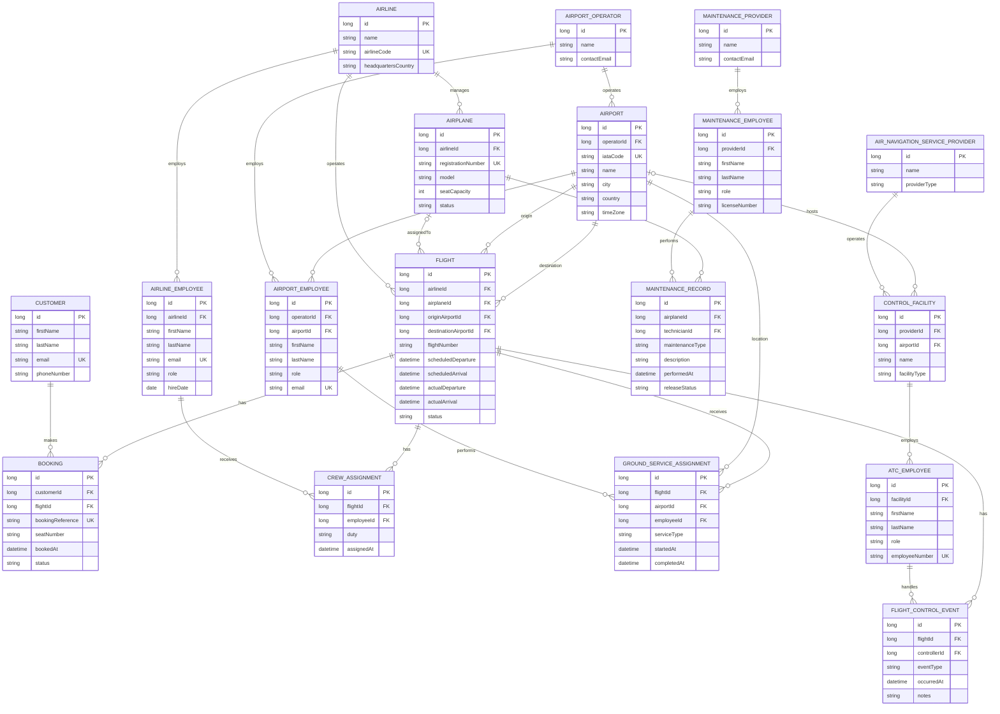

THE IDEA
---
basically a flight system, there will be two parts. the first part is a basic flight booking system. the second (if i finish early) is a flight control and security system like the FAA and service center, etc...

------------------------------------------------------------------------------------------------------------------------

ERD Diagram
---
