THE IDEA
---
basically a flight system, there will be two parts. the first part is a basic flight booking system. the second (if i finish early) is a flight control and security system like the FAA and service center, etc...

------------------------------------------------------------------------------------------------------------------------

Cron Jobs
---

**Flight status update:** `FlightService.updateFlightStatus()` runs every 5 minutes using `@Scheduled(cron = "0 */5 * * * *")`.

- Changes `ACTIVE` to `IN_AIR` when `actualDeparture` is not null and its time has been reached.
- Changes `IN_AIR` to `CLOSED` when `actualArrival` is not null and its time has been reached.

Null actual times leave the status unchanged, allowing for delayed flights. Time checks use the server's local time.

Customer registration endpoints
---

Use these endpoints in order. Send JSON with `Content-Type: application/json`. Only setup requires the Bearer token returned by login.

| Method | Endpoint | What it does | Required fields | Sample JSON body |
| --- | --- | --- | --- | --- |
| POST | `/auth/users/register/email` | Checks email and CPR availability, saves a pending registration, and requests a verification email. | `email`, `cpr` | `{"email":"you@example.com","cpr":"123456789"}` |
| POST | `/auth/users/verification` | Verifies the code, creates an inactive customer account with status `SETUP_REQUIRED`, and returns a success message instructing the user to log in with CPR as their initial password. | `email`, `code` | `{"email":"you@example.com","code":"482193"}` |
| POST | `/auth/users/login` | Logs in using email and CPR as the initial password. Returns the JWT in the response's `message` field. | `email`, `password` | `{"email":"you@example.com","password":"123456789"}` |
| POST | `/auth/users/setup` | Completes the logged-in customer's details, changes the password, activates the account, then deletes pending after saving successfully. | `password`, `fName`, `lName`, `phoneNumber`, `phoneNumberOpeningCode`, `securityQuestion`, `securityQuestionAnswer` | See the complete JSON example below. |

Codes expire after 10 minutes and allow three incorrect attempts. Request a new code after expiry if verification has not been completed. After verification, setup does not require the code or pending ID and is not limited by the code's expiry.

Setup-required accounts can log in and finish setup but cannot access other protected endpoints. Send `Authorization: Bearer <token>` when calling `/auth/users/setup`. The account and email come from the authenticated user; no email field is required in the request body. The account must have status `SETUP_REQUIRED` and a verified pending registration. Choose a new password different from the CPR. Successful setup sets `isActive` to true and status to `ACTIVE`.

All fields in this setup example are required:

```json
{
  "password": "your-new-password",
  "fName": "Saud",
  "lName": "Example",
  "phoneNumber": "12345678",
  "phoneNumberOpeningCode": "+973",
  "securityQuestion": "Your question",
  "securityQuestionAnswer": "Your answer"
}
```

Password reset endpoint
---

Requires an active account and `Authorization: Bearer <token>`, including for this reset route. Send JSON with `Content-Type: application/json`.

| Method | Endpoint | What it does | Required fields | Sample JSON body |
| --- | --- | --- | --- | --- |
| POST | `/auth/users/forgetPassword` | Checks the customer's security answer, resets their password to CPR, sends an email, and returns a confirmation message. | `email`, `securityQuestionAnswer` | `{"email":"you@example.com","securityQuestionAnswer":"Your answer"}` |

The target must have a customer profile. Unknown email returns 404; an incorrect answer returns 401.

Change password endpoint
---

Requires an active account and `Authorization: Bearer <token>`. Send JSON with `Content-Type: application/json`.

| Method | Endpoint | What it does | Required fields | Sample JSON body |
| --- | --- | --- | --- | --- |
| POST | `/auth/users/changePassword` | Changes the logged-in user's password and returns a success message. | `newPassword` | `{"newPassword":"NewPassword123"}` |

The validator requires 8 to 30 characters, at least one uppercase letter and one digit, and no whitespace. Invalid passwords return 422; the current error message incorrectly says the maximum is 20.

Update profile endpoint
---

Requires an active account and `Authorization: Bearer <token>`. Send `multipart/form-data` with a required JSON part named `request` using `Content-Type: application/json`, and an optional file part named `image`.

| Method | Endpoint | What it does | Required fields | Sample JSON body |
| --- | --- | --- | --- | --- |
| PUT | `/auth/users/updateProfile` | Updates profile details and returns `Profile updated successfully` with status 200. | `request` (JSON multipart part). Optional: `userId` (query parameter), `image` (file part). | `{"phoneNumber":"36001234","phoneNumberOpeningCode":"+973"}` (content of the `request` part) |

Without `userId`, updates the logged-in user's profile. Allowed JSON fields are `phoneNumber`, `phoneNumberOpeningCode`, `securityQuestion`, and `securityQuestionAnswer`. The security question and answer must be provided together and must not be blank. Either phone field can be supplied on its own; the resulting number and country code must be valid together. Omitted fields remain unchanged.

Supplying `userId`, for example `/auth/users/updateProfile?userId=2`, requires an `FAA_ADMIN` account with a linked FAA admin profile. This allows updates to the target user's phone details, image, `fName`, `lName`, `cpr`, `emailAddress`, and `active`. Security question and answer cannot be changed when `userId` is supplied. Even FAA admins must supply `userId` to change names, CPR, email, or account activation state.

Names must not be blank. CPR must contain exactly nine digits and be available; email must have a valid format and be available. Changing email or CPR requires the target account to have completed setup. Set `active` to `false` to deactivate the account and set its status to `DEACTIVATED`; `true` is rejected. Profile details and image updates require a linked customer, airline employee, or FAA admin profile.

To upload an image, save the JSON example to `profile.json` and send it as the `request` part:

```powershell
curl.exe -X PUT "http://localhost:8080/auth/users/updateProfile" -H "Authorization: Bearer YOUR_TOKEN" -F "request=@profile.json;type=application/json" -F "image=@profile.jpg"
```

Omit the `image` part to keep the current image. A nonempty uploaded file is saved under `uploads/` with a generated filename, and its path is stored in the profile's `imageUrl`.

Add airplane endpoint
---

Requires an active airline employee with airline role `ADMIN` and `Authorization: Bearer <token>`. Send JSON with `Content-Type: application/json`.

| Method | Endpoint | What it does | Required fields | Sample JSON body |
| --- | --- | --- | --- | --- |
| POST | `/airlineAdmin/airplanes` | Adds a grounded airplane to the logged-in admin's airline and returns an `AddAirplaneResponse` with status 201. | `registrationNumber`, `model`, `standardSeatCapacity`, `firstClassSeatCapacity`, `maxMileage` | `{"registrationNumber":"A9C-ABC","model":"Airbus A320","standardSeatCapacity":150,"firstClassSeatCapacity":12,"maxMileage":6000}` |

Registration number must be unique. Both seat capacities and max mileage must be greater than zero. Missing or invalid fields return 422; a duplicate registration number returns 404. Activation requires FAA approval.

Request airplane activation endpoint
---

Requires an active airline employee with airline role `ADMIN` and `Authorization: Bearer <token>`.

| Method | Endpoint | What it does | Required fields | Sample JSON body |
| --- | --- | --- | --- | --- |
| POST | `/airlineAdmin/airplanes/{airplaneId}/requestActivation` | Creates a pending activation request and returns an `AirplaneRequestResponse` with status 201. | `airplaneId` (path) | No body. |

The airplane must belong to the admin's airline and must not already be active. An existing pending request blocks submission; seven days must pass after the last request before requesting again. Connected FAA admins receive the `airplane-activation-requested` SSE event after the transaction commits. The airplane stays grounded until FAA approval.

Add flight endpoint
---

Requires an active airline employee with airline role `ADMIN` and `Authorization: Bearer <token>`. Send JSON with `Content-Type: application/json`.

| Method | Endpoint | What it does | Required fields | Sample JSON body |
| --- | --- | --- | --- | --- |
| POST | `/airlineAdmin/airplanes/{airplaneId}/addFlight` | Creates an active flight for the admin's airline and returns an `AddFlightResponse` with status 201. | `airplaneId` (path), `originAirportIataCode`, `arrivalAirportIataCode`, `scheduledDeparture`, `scheduledArrival` | `{"originAirportIataCode":"BAH","arrivalAirportIataCode":"DXB","scheduledDeparture":"2027-01-10T10:00:00","scheduledArrival":"2027-01-10T12:00:00"}` |

Use existing, different airport IATA codes and local date-times without an offset. Departure must be in the future and arrival must be later. The airplane must belong to the admin's airline, be active, and have at least two hours between non-cancelled flights. The flight number is generated from the airline code and flight ID, and available seat counts start at the airplane's capacities.

Search flights endpoint
---

Requires an active account and `Authorization: Bearer <token>`. Supply filters as query parameters.

| Method | Endpoint | What it does | Required fields | Sample JSON body |
| --- | --- | --- | --- | --- |
| GET | `/flights/search` | Returns a page of available flights matching the supplied filters. | None. Optional query parameters: `date`, `airlineCode`, `originAirport`, `destinationAirport`, `originCity`, `destinationCity`, `originCountry`, `destinationCountry`, `seatType`, `page`, `size`, `sort`. | No body. |

For example, `/flights/search?date=2027-01-10&originAirport=BAH&destinationAirport=DXB&seatType=standard&page=1&size=10&sort=scheduledDeparture,asc`.

Only flights with status `ACTIVE`, an active airplane, available seats, and scheduled departure more than five minutes away are returned. Filters can be combined; all supplied filters must match. Airline codes, airport IATA codes, cities, and countries use exact matches ignoring case. `date` filters scheduled departure by calendar day in `yyyy-MM-dd` format and must be today or later, using the server's local time. `seatType` must be exactly `standard` or `firstClass` and requires availability in that class; omitting it allows either class.

Pagination starts at `page=1` and defaults to `size=10`. Page must be at least 1, and size must be between 1 and 100. The default sort is `scheduledDeparture,asc`; supported fields are `scheduledDeparture`, `scheduledArrival`, and `flightNumber`, with direction `asc` or `desc`. Ties are ordered by flight ID ascending.

The response contains `content` (flight details), `page`, `size`, `totalElements`, and `totalPages`. Each flight includes its ID, flight number, airline code, origin and destination airport codes, cities and countries, scheduled times, and available seat counts for both classes. A page with no results returns an empty `content` list.

Book flight endpoint
---

Requires an active account and `Authorization: Bearer <token>`. Users can book for themselves; only an airline employee with airline role `ADMIN` can book for another user, and only on their own airline.

| Method | Endpoint | What it does | Required fields | Sample JSON body |
| --- | --- | --- | --- | --- |
| POST | `/customer/{userId}/flights/{flightId}/{seatType}/{seatId}/book` | Books the selected seat, reduces the available seat count, and returns a `BookingResponse` with status 201. | `userId`, `flightId`, `seatType`, `seatId` (all path parameters) | No body. |

For example, `/customer/1/flights/2/standard/3/book`. The user and flight must exist. `seatType` must be exactly `standard` or `firstClass`; `seatId` starts at 1 and must be within that class's capacity. The seat must be available, both flight and airplane must be active, and departure must be more than five minutes away. A successful booking has status `BOOKED` and a generated booking reference.

View bookings endpoint
---

Requires an active account and `Authorization: Bearer <token>`.

| Method | Endpoint | What it does | Required fields | Sample JSON body |
| --- | --- | --- | --- | --- |
| GET | `/bookings` | Returns the logged-in user's bookings, or all bookings for the logged-in airline admin's airline ordered by booking time descending. | None. | No body. |

Airline employees must have airline role `ADMIN` to use this endpoint. Other account roles receive their own booking list. The response is a list of booking objects.

Cancel booking endpoint
---

Requires an active account and `Authorization: Bearer <token>`. Only the booking owner or an airline employee with airline role `ADMIN` for the booking's airline can cancel it.

| Method | Endpoint | What it does | Required fields | Sample JSON body |
| --- | --- | --- | --- | --- |
| DELETE | `/bookings/{bookingId}` | Marks a booking as `CANCELLED`, restores the available seat count for its class, and returns a `BookingResponse` with status 200. | `bookingId` (path) | No body. |

The booking must exist and have status `BOOKED`. Owners must cancel at least 48 hours before departure or receive 417; an admin of the booking's airline is exempt from this time limit. The booking record is retained.

Search bookings endpoint
---

Requires an active airline employee with airline role `ADMIN` and `Authorization: Bearer <token>`. Results are restricted to the logged-in admin's airline.

| Method | Endpoint | What it does | Required fields | Sample JSON body |
| --- | --- | --- | --- | --- |
| GET | `/bookings/search` | Returns bookings matching the supplied filters, ordered by booking time descending. | None. Optional query parameters: `userId`, `flightId`, `status`. | No body. |

For example, `/bookings/search?userId=1&flightId=2&status=BOOKED`. Status must be `BOOKED`, `CANCELLED`, or `FINISHED`. Filters can be used individually or together; results must match all supplied filters. Omit all filters to retrieve every booking for the admin's airline.

Create airline endpoint
---

Requires an active `FAA_ADMIN` account and `Authorization: Bearer <token>`. Supply query parameters or form fields; this controller does not accept a JSON request body.

| Method | Endpoint | What it does | Required fields | Sample JSON body |
| --- | --- | --- | --- | --- |
| POST | `/faaadmin/airlines` | Creates and returns an airline. | `name`, `airlineCode`, `headquartersCountry` (query parameters or form fields) | No JSON body. |

For example, `POST /faaadmin/airlines?name=Example%20Air&airlineCode=EA&headquartersCountry=Bahrain`. The name and airline code must be unique. The current service does not validate missing or blank fields.

View airlines endpoint
---

Requires an active `FAA_ADMIN` account and `Authorization: Bearer <token>`.

| Method | Endpoint | What it does | Required fields | Sample JSON body |
| --- | --- | --- | --- | --- |
| GET | `/faaadmin/airlines` | Returns the list of all airlines. | None. | No body. |

Add airline admin endpoint
---

Requires an active `FAA_ADMIN` account and `Authorization: Bearer <token>`. Send JSON with `Content-Type: application/json`.

| Method | Endpoint | What it does | Required fields | Sample JSON body |
| --- | --- | --- | --- | --- |
| POST | `/faaadmin/airlines/{airlineId}/addAirlineAdmin` | Creates an airline employee with airline role `ADMIN` and CPR as the initial password. Returns the submitted details with the security answer cleared, with status 201. | `airlineId` (path), `emailAddress`, `cpr`, `fName`, `lName`, `phoneNumberOpeningCode`, `phoneNumber`, `hireDate`, `salary`, `securityQuestion`, `securityQuestionAnswer` | See the complete JSON example below. |

The airline must exist, and email and CPR must be available. CPR must contain exactly nine digits, the email must have a valid format, and the phone number must be valid for its country code. Salary must be greater than zero; hire date uses `yyyy-MM-dd`. Names, security question, and security answer must not be blank.

All fields in this example are required:

```json
{
  "emailAddress": "admin@example.com",
  "cpr": "123456789",
  "fName": "Saud",
  "lName": "Example",
  "phoneNumberOpeningCode": "+973",
  "phoneNumber": "36001234",
  "hireDate": "2026-10-01",
  "salary": 1200,
  "securityQuestion": "Your question",
  "securityQuestionAnswer": "Your answer"
}
```

Pending airplane requests endpoint
---

Requires an active `FAA_ADMIN` account with a linked FAA admin profile and `Authorization: Bearer <token>`.

| Method | Endpoint | What it does | Required fields | Sample JSON body |
| --- | --- | --- | --- | --- |
| GET | `/faaadmin/airplaneRequests` | Returns a list of `AirplaneRequestResponse` objects for activation requests with status `PENDING`, with status 200. | None. | No body. |

Requests are returned across all airlines. An empty list is returned when no requests are pending. Fetch this endpoint after connecting or reconnecting to notifications to recover outstanding requests, and deduplicate by `requestId`.

Review airplane request endpoint
---

Requires an active `FAA_ADMIN` account with a linked FAA admin profile and `Authorization: Bearer <token>`. Send JSON with `Content-Type: application/json`.

| Method | Endpoint | What it does | Required fields | Sample JSON body |
| --- | --- | --- | --- | --- |
| PUT | `/faaadmin/airplaneRequests/{requestId}` | Accepts or denies a pending activation request, records the reviewer and review time, and returns an `AirplaneRequestResponse` with status 200. | `requestId` (path), `status`; `reviewReason` is required when denying. | `{"status":"ACCEPTED","reviewReason":"Safety checks passed"}` |

Status must be `ACCEPTED` or `DENIED`. Accepting sets the airplane to `ACTIVE`; denying sets it to `GROUNDED`. A denial requires a nonblank reason; acceptance defaults to `approve` when the reason is missing or blank. Reasons must not exceed 500 characters. The request must exist and still have status `PENDING`.

Live notifications (SSE)
---

An active, authenticated user opens `GET /notifications` with `Authorization: Bearer <JWT>`.
The response is `text/event-stream` and stays open. User ID and role come from the JWT-authenticated
account, never from client-supplied parameters. Each tab/device gets its own connection.

Try it in PowerShell (replace the token with an FAA admin token):

```powershell
curl.exe -N -H "Authorization: Bearer YOUR_FAA_TOKEN" http://localhost:8080/notifications
```

The first event is `connected`. While this command is running, use an airline admin token to call
`POST /airlineAdmin/airplanes/{airplaneId}/requestActivation` for a valid airplane. After the request
transaction commits, all connected FAA admins receive `airplane-activation-requested`. Its JSON
payload is the same `AirplaneRequestResponse` DTO returned to the requesting airline admin.
Customers and airline employees do not receive this event. A rejected or rolled-back request sends nothing.

Reuse `NotificationService` from other business services:

```java
notificationService.sendToUser(userId, "booking-updated", bookingResponse);
notificationService.sendToRole(User.Role.FAA_ADMIN, "airplane-activation-requested", requestResponse);
```

Choose recipients on the backend. Use user delivery for private updates; role delivery reaches
every connected member of that role, so it is not suitable for airline-specific private information.
Payloads should be DTO snapshots, not JPA entities. Calls made inside a Spring transaction are
deferred until successful commit; calls outside a transaction send immediately.

The server sends a comment heartbeat every 25 seconds and closes streams after five minutes.
Clients must reconnect with a valid token; each new connection repeats authentication and account
checks. Role/account changes are reflected on reconnection, not immediately within an existing stream.
Disconnect the stream on logout. The SSE `retry` hint is three seconds, but a streaming `fetch`
client must implement its own reconnect loop and event parsing. Native browser `EventSource`
cannot set the required Authorization header; use a header-capable SSE client or streaming `fetch`.
The frontend handles named events to show toasts or update its notification UI.

Delivery is live and best-effort within one backend instance. There is no stored notification inbox,
event replay, or multi-server fan-out. After connecting/reconnecting, FAA clients should also fetch
`GET /faaadmin/airplaneRequests` to recover outstanding work and deduplicate by `requestId`.
Network writes use Spring MVC's blocking emitter API; a slow client can delay broadcasting.
For multiple backend instances or larger traffic, add a shared broker and bounded asynchronous delivery.

ERD Diagram
---
Implemented entities below follow the current JPA models. `Person` is a mapped superclass, so its fields appear in `CUSTOMER`, `AIRLINE_EMPLOYEE`, and `FAA_ADMIN`; it has no separate table. Attribute names use Java field names, with relationship IDs representing join columns. Enum attributes show Java types (not database storage types).

Entities marked `PLANNED` and their relationships are retained from the original design and are not implemented yet. In particular, `AIRPORT.operatorId` is planned. For implemented relationships, an optional parent (`o|`) reflects a nullable join column in the current model.

```mermaid
erDiagram
AIRLINE {
long id PK
string name UK
string airlineCode UK
string headquartersCountry
}

    AIRPLANE {
        long id PK
        long airlineId FK
        string registrationNumber UK
        string model
        int seatCapacity
        long maxMileage
        Status status "ACTIVE or GROUNDED; default GROUNDED"
    }

    AIRPLANE_REQUEST {
        long id PK
        long airplaneId FK "Required"
        ApprovalStatus status "PENDING, ACCEPTED, DENIED; default PENDING"
        string reviewReason "Up to 500 characters"
        datetime requestedAt "Creation timestamp"
        datetime reviewedAt
        long reviewedById FK "Nullable FAA admin reviewer"
    }

    FAA_ADMIN {
        long id PK
        string fName
        string lName
        string cpr UK "Required"
        string phoneNumberOpeningCode
        string phoneNumber
        byte[] imageData
        string imageUrl
        datetime createdAt
        datetime updatedAt
    }

    USER {
        long id PK
        string emailAddress UK "Required"
        string password "Required"
        string securityQuestion
        string securityQuestionAnswer
        Role role "CUSTOMER, AIRPORT_EMPLOYEE, AIRLINE_EMPLOYEE, FAA_ADMIN"
        boolean isActive
        Status status "SETUP_REQUIRED or ACTIVE"
        long customerId FK, UK "Nullable"
        long airlineEmployeeId FK, UK "Nullable"
        long faaAdminId FK, UK "Nullable"
    }

    PENDING_REGISTRATION {
        long id PK
        string emailAddress UK "Required"
        string cpr UK "Required"
        string codeHash "Required"
        datetime expiresAt "Required"
        int failedAttempts "Required"
        boolean verified "Required"
    }

    AIRLINE_EMPLOYEE {
        long id PK
        long airlineId FK
        string fName
        string lName
        string cpr UK "Required"
        string phoneNumberOpeningCode
        string phoneNumber
        byte[] imageData
        string imageUrl
        datetime createdAt
        datetime updatedAt
        AirlineRole airlineRole "PILOT, FLIGHT_ATTENDANT, GATE_RECEPTION"
        datetime hireDate
        long salary
    }

    AIRPORT_OPERATOR["AIRPORT_OPERATOR (PLANNED)"] {
        long id PK
        string name
        string contactEmail
    }

    AIRPORT {
        long id PK
        long operatorId FK "PLANNED; not in Airport model"
        string iataCode UK
        string name
        string city
        string country
        string timeZone
    }

    AIRPORT_EMPLOYEE["AIRPORT_EMPLOYEE (PLANNED)"] {
        long id PK
        long operatorId FK
        long airportId FK
        string firstName
        string lastName
        string role
        string email UK
    }

    FLIGHT {
        long id PK
        long airlineId FK
        long airplaneId FK
        long originAirportId FK
        long destinationAirportId FK
        string flightNumber
        datetime scheduledDeparture
        datetime scheduledArrival
        datetime actualDeparture
        datetime actualArrival
        string status
    }

    CUSTOMER {
        long id PK
        string fName
        string lName
        string cpr UK "Required"
        string phoneNumberOpeningCode
        string phoneNumber
        byte[] imageData
        string imageUrl
        datetime createdAt
        datetime updatedAt
    }

    BOOKING {
        long id PK
        long customerId FK
        long flightId FK
        string bookingRef UK
        string seatNumber
        datetime bookedAt
        datetime updatedAt
        string status
    }

    CREW_ASSIGNMENT["CREW_ASSIGNMENT (PLANNED)"] {
        long id PK
        long flightId FK
        long employeeId FK
        string duty
        datetime assignedAt
    }

    GROUND_SERVICE_ASSIGNMENT["GROUND_SERVICE_ASSIGNMENT (PLANNED)"] {
        long id PK
        long flightId FK
        long airportId FK
        long employeeId FK
        string serviceType
        datetime startedAt
        datetime completedAt
    }

    MAINTENANCE_PROVIDER["MAINTENANCE_PROVIDER (PLANNED)"] {
        long id PK
        string name
        string contactEmail
    }

    MAINTENANCE_EMPLOYEE["MAINTENANCE_EMPLOYEE (PLANNED)"] {
        long id PK
        long providerId FK
        string firstName
        string lastName
        string role
        string licenseNumber
    }

    MAINTENANCE_RECORD["MAINTENANCE_RECORD (PLANNED)"] {
        long id PK
        long airplaneId FK
        long technicianId FK
        string maintenanceType
        string description
        datetime performedAt
        string releaseStatus
    }

    AIR_NAVIGATION_SERVICE_PROVIDER["AIR_NAVIGATION_SERVICE_PROVIDER (PLANNED)"] {
        long id PK
        string name
        string providerType
    }

    CONTROL_FACILITY["CONTROL_FACILITY (PLANNED)"] {
        long id PK
        long providerId FK
        long airportId FK
        string name
        string facilityType
    }

    ATC_EMPLOYEE["ATC_EMPLOYEE (PLANNED)"] {
        long id PK
        long facilityId FK
        string firstName
        string lastName
        string role
        string employeeNumber UK
    }

    FLIGHT_CONTROL_EVENT["FLIGHT_CONTROL_EVENT (PLANNED)"] {
        long id PK
        long flightId FK
        long controllerId FK
        string eventType
        datetime occurredAt
        string notes
    }

    AIRLINE ||--o{ AIRPLANE : manages
    AIRLINE o|--o{ AIRLINE_EMPLOYEE : employs
    AIRLINE o|--o{ FLIGHT : operates
    AIRPLANE o|--o{ FLIGHT : assignedTo
    AIRPLANE ||--o{ AIRPLANE_REQUEST : has
    FAA_ADMIN o|--o{ AIRPLANE_REQUEST : reviews

    CUSTOMER o|--o| USER : linkedTo
    AIRLINE_EMPLOYEE o|--o| USER : linkedTo
    FAA_ADMIN o|--o| USER : linkedTo

    AIRPORT_OPERATOR ||--o{ AIRPORT : operates
    AIRPORT_OPERATOR ||--o{ AIRPORT_EMPLOYEE : employs
    AIRPORT ||--o{ AIRPORT_EMPLOYEE : workplace
    AIRPORT o|--o{ FLIGHT : origin
    AIRPORT o|--o{ FLIGHT : destination

    CUSTOMER o|--o{ BOOKING : makes
    FLIGHT o|--o{ BOOKING : has

    AIRLINE_EMPLOYEE ||--o{ CREW_ASSIGNMENT : receives
    FLIGHT ||--o{ CREW_ASSIGNMENT : has

    AIRPORT_EMPLOYEE ||--o{ GROUND_SERVICE_ASSIGNMENT : performs
    AIRPORT ||--o{ GROUND_SERVICE_ASSIGNMENT : location
    FLIGHT ||--o{ GROUND_SERVICE_ASSIGNMENT : receives

    MAINTENANCE_PROVIDER ||--o{ MAINTENANCE_EMPLOYEE : employs
    MAINTENANCE_EMPLOYEE ||--o{ MAINTENANCE_RECORD : performs
    AIRPLANE ||--o{ MAINTENANCE_RECORD : has

    AIR_NAVIGATION_SERVICE_PROVIDER ||--o{ CONTROL_FACILITY : operates
    AIRPORT o|--o{ CONTROL_FACILITY : hosts
    CONTROL_FACILITY ||--o{ ATC_EMPLOYEE : employs
    ATC_EMPLOYEE ||--o{ FLIGHT_CONTROL_EVENT : handles
    FLIGHT ||--o{ FLIGHT_CONTROL_EVENT : has
```


-------------------------------------------------------------------------------------------
Used Resources
---
Baeldung email varification methods post
https://www.baeldung.com/java-email-validation-regex

GeekForGeeks Spring boot sending email via SMTP tutorial
https://www.geeksforgeeks.org/springboot/spring-boot-sending-email-via-smtp/

chatgpt suggested the code cpr.matches("[0-9]{9} in PendingRegistrationService sendCode() method

StackOverFlow for phone number validation
https://stackoverflow.com/questions/71654287/how-to-validate-phone-number-using-spring-boot
