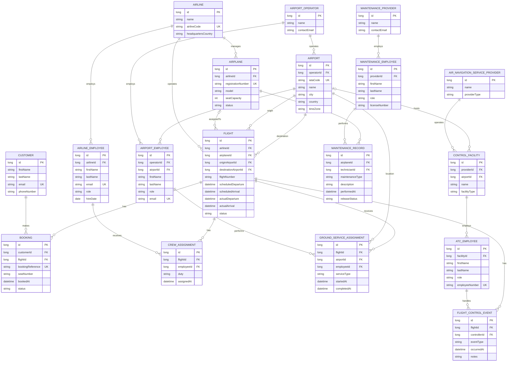

THE IDEA
---
basically a flight system, there will be two parts. the first part is a basic flight booking system. the second (if i finish early) is a flight control and security system like the FAA and service center, etc...

------------------------------------------------------------------------------------------------------------------------

Customer registration endpoints
---

Use these endpoints in order. Send JSON with `Content-Type: application/json`; no login is required.

| Method | Endpoint | What it does | Required fields | Sample JSON body |
| --- | --- | --- | --- | --- |
| POST | `/auth/users/register/email` | Checks email and CPR availability, saves a pending registration, and requests a verification email. | `email`, `cpr` | `{"email":"you@example.com","cpr":"123456789"}` |
| POST | `/auth/users/verification` | Verifies the code and returns the pending registration ID (for example, `12`). | `email`, `code` | `{"email":"you@example.com","code":"482193"}` |
| POST | `/auth/users/register` | Creates the customer and user using the pending email and CPR, then deletes pending after saving successfully. | `pendingRegistrationId`, `code`, `password`, `fname`, `lname`, `phoneNumber`, `phoneNumberOpeningCode`, `securityQuestion`, `securityQuestionAnswer` | See the complete JSON example below. |

Use the code received by email and the ID returned by verification in the final request. Codes expire after 10 minutes and allow three incorrect attempts. Request a new code after expiry if needed.

All fields in this final registration example are required, including `phoneNumber`, `phoneNumberOpeningCode`, `securityQuestion`, and `securityQuestionAnswer`:

```json
{
  "pendingRegistrationId": 12,
  "code": "482193",
  "password": "your-password",
  "fname": "Saud",
  "lname": "Example",
  "phoneNumber": "12345678",
  "phoneNumberOpeningCode": "+973",
  "securityQuestion": "Your question",
  "securityQuestionAnswer": "Your answer"
}
```

ERD Diagram
---

