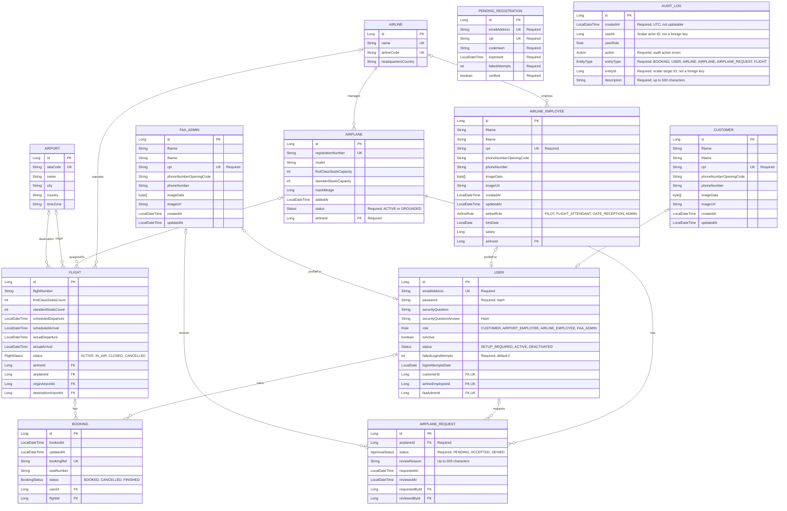

# Implemented system ERD

This diagram documents the 12 current JPA entities as of 8 October 2026. The [original ERD](../README.md#erd-diagram) is preserved separately, including its wider planned scope.

Names and types below follow Java fields, rather than PostgreSQL column spelling or SQL types. Relationship attributes use the Java relationship name followed by `Id` to represent their join columns. `PK`, `FK`, and `UK` mean primary, foreign, and unique keys. `Required` marks explicit non-null mappings; other attributes have no explicit non-null constraint in the model. Relationship cardinalities reflect JPA nullability, which can be less strict than service validation.

## Mapping notes

- `Person` is a `@MappedSuperclass`, not an entity or separate table. Its fields are inherited by `Customer`, `AirlineEmployee`, and `FAAAdmin` and are expanded in each box above. CPR uniqueness is mapped separately within each profile table.
- Bookings belong to `User`, not directly to `Customer`. Airplane requests also reference `User` as their requester and `FAAAdmin` as their reviewer.
- User profile links are nullable, unique one-to-one relationships. The mappings do not impose a database constraint requiring exactly one of the three profiles.
- `PendingRegistration` has no mapped relationship to `User`; email and CPR matching happens in application code. `AuditLog.userId` and `entityId` are scalar identifiers, not JPA relationships, so no foreign-key edges are drawn for them.
- `User.role` and `User.status` do not declare `@Enumerated`, so their JPA mapping uses enum ordinals by default. Other enum fields in this diagram explicitly use `EnumType.STRING`. The diagram shows enum names for readability, not their physical database encoding.
- Airplane capacities are total seats; flight seat counts track remaining availability. There is no separate seat entity. `flightNumber` has no mapped unique constraint, while `bookingRef` does.
- `AIRPORT_EMPLOYEE` exists as a `User.Role` value, but there is no implemented airport-employee entity. Crew, ground-service, maintenance, and air traffic control entities from the original ERD are not included here.
- `Email` and the request/response DTOs are not entities. Despite its package name, `model.request.AirplaneRequest` is an entity and is included. SSE connections are in memory, not persisted entities.

## Entity-to-table reference

These are the explicit `@Table` names in source. Hibernate's physical naming strategy can normalize identifiers (for example, `FAA_Admins`).

| Entity | Declared table |
| --- | --- |
| Airline | `airline` |
| Airplane | `airplanes` |
| Airport | `airports` |
| Flight | `flights` |
| Booking | `bookings` |
| User | `users` |
| Customer | `customers` |
| AirlineEmployee | `airline_employees` |
| FAAAdmin | `FAA_Admins` |
| AirplaneRequest | `airplane_requests` |
| PendingRegistration | `pending_registrations` |
| AuditLog | `audit_logs` |

Source: [entity models](../src/main/java/com/ga/saudsFlightSystem/model/) and [AirplaneRequest](../src/main/java/com/ga/saudsFlightSystem/model/request/AirplaneRequest.java). This is a source-mapping diagram, not a reverse-engineered snapshot of a particular local database.
